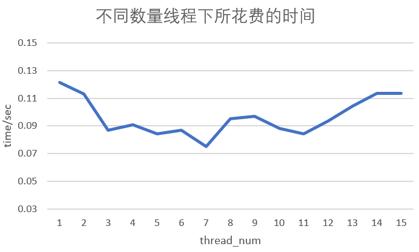
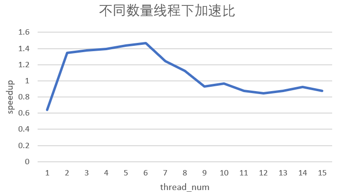
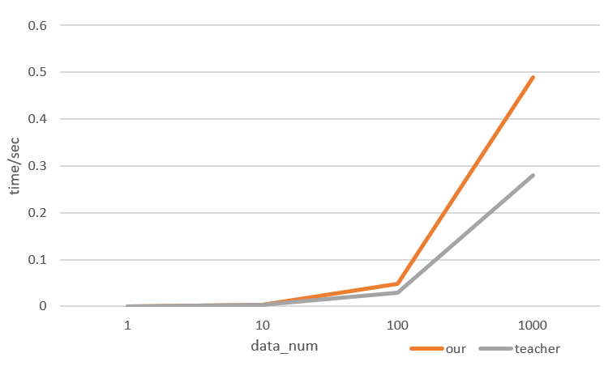

# Lab1 test report

## 1. 实验概要

&emsp;&emsp;多线程编程是高性能编程的技术之一，实验1将针对数独求解问题比较多线程与单线程的性能差异、同一功能不同代码实现的性能差异以及多线程在不同硬件环境下的性能差异。

### 1.1 程序输入

&emsp;&emsp;程序将在控制台接收用户输入，该输入应为某一目录下的一个数独谜题文件，该文件包含多个数独谜题，每个数独谜题按固定格式存储在该文件中。

### 1.2 程序输出

&emsp;&emsp;实验中把数独的解按与输入相对应的顺序输出到标准输出流中。

### 1.3 Sudoku算法

&emsp;&emsp;实验共提供了4中不同的Sudoku求解算法：BASIC,DANCE,MINA和MINAC。其中，DANCE算法速度最快，BASIC算法速度最慢。实验中选用的是最快的DANCE算法。

### 1.4 性能指标

&emsp;&emsp;实验以求解完单个输入文件里的所有数独题并把数独的解按顺序写入文件所需要的时间开销作为性能指标。一般而言，可以用加速比直观地表示并行程序与串行程序之间的性能差异（加速比：串行执行时间与并行执行时间的比率，是串行与并行执行时间之间一个具体的比较指标）。

&emsp;&emsp;为了精确地测量性能，时间开销均在数独求解进程/线程绑定CPU的某个核的条件下测得，这样保证了该进程/线程不被调度到其他核中运行，但不保证该进程/线程独占某个核。更精确的测量方法可以先把CPU的某个核隔离，而后再绑定在某个进程/线程上，这样该CPU核心不会运行其他的用户程序。当CPU资源充足时（CPU核心数足够多，当前正在运行的进程/线程足够少），是否把核隔离并没有多大影响，因为操作系统的调度策略不会频繁的对线程/进程进行无谓的调度。

### 1.5 实验环境

&emsp;&emsp;实验中共有2个不同的实验环境：**ENV1**和**ENV2**。

&emsp;&emsp;**ENV1:** linux内核版本为4.15.0-88-generic；16GB内存；CPU型号为Intel(R) Xeon(R) CPU E5-2635 0 @ 2.00GHz，共有2个物理CPU；每个物理CPU有8个物理核心，共有16个物理核心；不使用超线程技术。

&emsp;&emsp;**ENV2:** linux内核版本为4.15.0-88-generic；8GB内存；CPU型号为Intel(R) Core(TM) i7-6350HQ CPU @ 2.35GHz，共1个物理CPU；每个物理CPU有4个物理核心，共有4个物理核心；使用超线程技术，1个物理核心模拟出2个逻辑核心，共有8个逻辑核心。

如无特别说明，默认使用ENV1。

### 1.6 代码实现版本

&emsp;&emsp;实验中共使用两份不同的代码：**Code1**和**Code2**。

&emsp;&emsp;**Code1:** 原生的数独求解代码，即本实验中所提供的代码，只能以单线程模式运行。

&emsp;&emsp;**Code2:** 为适应多线程而在Code1上进行了一系列的修改和增添而成。在Code2中，可通过参数的调节而控制线程数量。与Code1相比，Code2的代码量多了350行左右。注：Code2共有3种不同类型的线程，即读取文件，求解数独，输出文件。我们用一个线程进行读取，多个线程进行计算求解数独，再用一个线程输出。程序总线程数 = sudoku_solve线程数 + 1 file_read线程 +1个输出线程

&emsp;&emsp;如无特别说明，默认使用Code2。

## 2. 性能测试

&emsp;&emsp;程序的性能会受到诸多因素的影响，其中包括软件层面的因素和硬件层面的因素。本节将分析比较多线程程序与单线程程序的性能差异、同一功能不同代码实现的性能差异，以及同一个程序在不同硬件环境下的性能差异。

### 2.1 多线程与单线程性能比较

&emsp;&emsp;单线程程序只能利用1个CPU核心，而多线程程序能使CPU的多个核心并行运作，因此，多线程能够充分发挥多核CPU的优势。在一定范围内，加速比会随着线程数的增加而增长，即时间开销越少、效率越高。当线程数超过CPU核心数时，性能会有所下降。

&emsp;&emsp;为了比较多线程与单线程性能差异，实验将提供1个大小为82.0KB、具有1000个数独题的文件，而后分别使用单个excute线程和n个excute线程分别对该文件内的所有数独题进行求解，并把解写入到文件中，测量这一部分所需要的时间开销并计算加速比。**其中我们对输出顺序进行了排序**

&emsp;&emsp;图2-1展示了不同线程数对性能造成的影响，其2条折线：**Consumed time**和**Speedup**分别表示随sodoku_solve线程数量的变化所需的时间开销和相应的加速比。从图2-1可以看出，当总线程数小于CPU总核心数时，随着线程数的增加，所需要的时间开销越小、加速比更高。从excute线程数为7开始，总线程数（详见1.6）开始超过CPU物理核心数，线程开始被操作系统调度，调度会有一定的开销，所以性能会有所下降。因为输入输出还需要两个线程，当然，这是理论情况。但是实际实现由些许出入。

&emsp;&emsp;在实验中，实验中读入线程和，CPU资源主要用在了sort即输出和excute线程上。当sudoku_slove线程数为5和6时，sudoku_solve线程会被调度，但调度次数不是特别多（因读入线程和excute占用CPU资源少，并且完成后线程会退出），所以最慢的excute线程成为瓶颈的问题不是特别明显。当excute线程数从6增加到7时，会有几个因素：各个excute线程任务量相当；各个excute线程绑定在CPU核心上；线程数超过CPU核心数，因此会有2个excute线程绑定同一个CPU核心的现象，瓶颈会出现在这里，即会有较快完成任务的excute线程等待较慢的sudoku_solve线程（共享同1个核心的excute线程必然会比较慢）。因此，在excute线程超过6时，会出现性能急剧下降的现象。 

**
图2-1、图2-2 不同线程数需要的时间开销及相应加速比
**

### 2.2 不同代码实现性能比较

&emsp;&emsp;对于实现同一功能的程序，可以有多种不同的代码实现，不同的代码实现在时间开销上不一定会相同。实验中使用的Code2比Code1多了一些额外的代码段，因此Code2的时间开销要略大与Code1，并且随着问题规模的增大，差距也会愈加明显。

​		尤其是，**我们自己的代码还需要输出**，而输出非常消耗时间，因此随着数据的增大，消耗时间的增加是显而易见的。

&emsp;&emsp;考虑到代码可读性、可扩展性或其他因素，有时会在代码实现上增加一些额外的代码段。当这些额外的代码段被调用的次数足够多时，其所造成的时间开销会逐渐显现出来。

&emsp;&emsp;实验将使用2份不同的代码进行性能比较：Code1和Code2。实验提供8个不同大小的文件，每个文件分别有数独题：1，10，100，1000，10000。分别用Code1和Code2对这些文件进行求解（此处Code1和Code2都是使用单个数独求解线程进行求解），并测量时间开销。

​	这是四个线程的情况：

**
图2-3 不同代码实现时间开销对比
**
