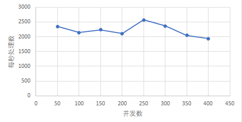
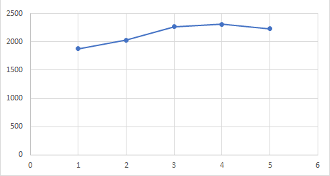

# Lab 2 Test Report

## 实验内容

实现一个HTTP服务器

### 问题描述

从头开始构建基于 HTTP/1.1 的 HTTP 服务器。并通过高并发编程技巧来保证Web服务器的性能。

### 我们的工作

实现了基础部分

### 其他说明

按照实验要求输入从而启动服务器，输入 quit 可以退出服务器。

运行之前需要加权限，在htdocs文件夹下，使用chmod 600（读） index.html 添加(读写、执行）权限(不能在共享文件夹里操作）

## 测试

### 性能测试

#### 测试方法

使用 HTTP 客户端测试工具 [ab-Apache HTTP服务器基准测试工具](http://httpd.apache.org/docs/current/programs/ab.html)。

测试了在不同的并发请求数、不同的客户请求数下：

1. 在不同的计算机环境上运行服务器时，不同线程数的服务器的情况；
2. 在多台计算机上运行客户端并同时访问另一台计算机上运行的服务端的情况；

#### 实验环境

linux内核版本：Ubuntu 18.04.02

cpu核数：4

CPU型号：Intel(R) Core(TM) i7-8565U CPU @ 1.80GHz   1.99 GHz

#### 2.2.3 性能分析

##### 测试一 并发客户端数量不同时HTTP服务器的性能 

当并发数上升的时候，理论上每秒处理数是会上升的。随着上升，最后会趋于稳定，这是由于服务器的性能限制

##### 测试二 不同线程数目的HTTP服务器性能

如图，当线程数小于内核数，也就是4时，缓慢上升，之后缓慢下降

